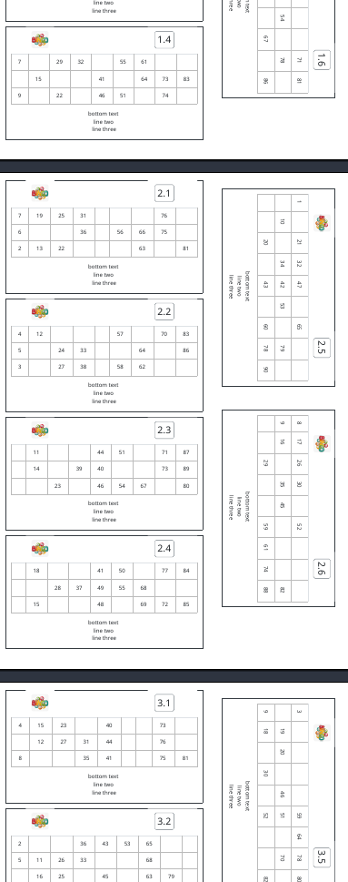

# CartellaTombolaPDF
Tombola card pdf generator from html format template

## Results


## Setting up
```
pip3 install jinja2
pip3 install pdfkit
pip3 install PyPDF2
sudo apt install wkhtmltopdf
```

## Run the script
```
cat cards_set.txt > python3 pdf_formatter.py
```

OR

Pipe generator output directly into pdf_formatter

```
python3 generator.py | python3 pdf_formatter.py -b "place your bottom text here"
```

## _generator.py_ arguments
-n  Number of card sets. Default value is 1

### _pdf_formatter.py_ Arguments
-b  Bottom text

-l  Logo filename

## Genrate multiple card sets


This command will generate 5 card sets:
```
python3 generator.py -n 5 | python3 pdf_formatter.py -b "place your bottom text here" -l logo.png
```

All the sets will be merged into a single pdf file

## _cards_set.txt_ sample
Input must be formatted in the following way: [cards_set.txt sample](cards_set.txt)

Formatting rules:
- there must be two lines for each card:
	- the first one is the name of that card inside the set
	- the second one is a Python list containing one list of integers for each row (of that card)
- everything after the last pair of lines will be discarded (odd line)


